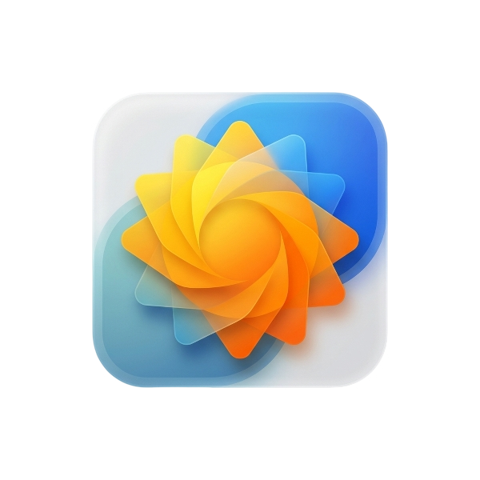

<div align="center">



# Sol ☀️

**A Modern Active Directory & Computer Management Suite for Windows**

[](https://dotnet.microsoft.com/)
[](https://learn.microsoft.com/windows/apps/windows-app-sdk/)
[](LICENSE)
[](https://www.microsoft.com/windows)
[](https://www.buymeacoffee.com/mmdevalpha)

*Fast, elegant, and secure IT administration with native Fluent 2 design.*

</div>

---

## 🌟 Overview

**Sol** is a native Windows desktop application built for IT administrators, helpdesk teams, and systems engineers. Built on **.NET 10** and **WinUI 3 (Windows App SDK)**, Sol streamlines daily Active Directory management, computer administration, BitLocker key recovery, and account operations into a high-performance, distraction-free interface.

---

## ✨ Features

### 🔍 Central Landing Hub
- **Unified Fast Search**: Search for both Active Directory **Users** and **Computers** with instant navigation.
- **Fluent 2 Design**: Native Mica backdrop material with automatic light/dark theme adaptation.

### 👤 User Workspace
- **Complete AD Profile & Identity**: Display Name, SamAccountName, UPN, Employee ID, OU Path, and Security Identifier (**SID**) with one-click copy buttons.
- **Organization & Reporting**: Manager navigation, Direct Reports, and Group Memberships.
- **Safe In-Place Editing**: Modify user attributes (Email, Phone, Office, Address) directly in Active Directory.
- **Password & Security Management**:
  - Reset passwords with auto-generated secure 16-character complex passwords.
  - One-click account unlock, enable/disable, and force password change at next logon.

### 💻 Computer Workspace
- **System Details & Status**: Operating System version, DNS Hostname, OU Path, and Account Status.
- **BitLocker Recovery Keys**: Discover and copy BitLocker recovery passwords stored in AD.
- **Remote Tools**: Launch Ping, Remote Desktop (RDP), or PowerShell sessions against the target machine.
- **Owner Relationship**: Inspect `ManagedBy` and jump directly to the owner's User Workspace.

### 🌍 Localization (English & German)
- Fully localized with zero hardcoded strings.
- German translations adhere to official **Microsoft Windows Server & Active Directory terminology**.

---

## 🛠️ Tech Stack

| Component | Technology |
|---|---|
| **Framework** | [.NET 10 (C# 14)](https://dotnet.microsoft.com/) |
| **UI** | [WinUI 3 / Windows App SDK 1.7](https://learn.microsoft.com/windows/apps/winui/winui3/) |
| **Architecture** | MVVM — [CommunityToolkit.Mvvm](https://learn.microsoft.com/dotnet/communitytoolkit/mvvm/) |
| **Controls** | [CommunityToolkit.WinUI](https://learn.microsoft.com/windows/communitytoolkit/) |
| **Directory Access** | LDAP via `System.DirectoryServices.AccountManagement` |
| **Deployment** | Self-contained, unpackaged (no MSIX or Store required) |

---

## 🚀 Getting Started

### Prerequisites
- **Windows 11** (or Windows 10 1809+, Windows Server 2022/2025)
- [**.NET 10 SDK**](https://dotnet.microsoft.com/download) or later
- **Visual Studio 2022** or later with the **Windows App SDK** workload
- Domain-joined machine or RSAT tools installed

### Build & Run

```bash
git clone https://github.com/mm-dev-alpha/Sol.git
cd Sol
```

```powershell
dotnet restore src/Sol/Sol.csproj
dotnet test src/Sol.Tests/Sol.Tests.csproj
dotnet run --project src/Sol/Sol.csproj
```

### Publish a Release Build

```powershell
dotnet publish src/Sol/Sol.csproj -c Release -r win-x64 --self-contained -o ./publish
```

The `./publish` folder contains a standalone `Sol.exe` — no runtime installation needed on target machines.

---

## ⚙️ Configuration

Sol stores settings locally via Windows App SDK LocalSettings:
- **Active Directory Domain**: Custom domain override or automatic discovery.
- **Language**: Auto-detect system language or manually select English / German.

---

## 🔒 Security & Privacy

- **No Telemetry**: Sol collects and transmits zero analytics or telemetry data.
- **Local Only**: All settings remain on your local machine.
- **Safe Operations**: Write operations (account unlock, password reset, attribute changes) require explicit confirmation.

---

## ☕ Support

If Sol saves you time, consider supporting the project:

[](https://www.buymeacoffee.com/mmdevalpha)

---

## 📄 License

This project is licensed under the **MIT License** — see the [LICENSE](LICENSE) file for details.

---

<div align="center">
  <sub>Built with ❤️ and <a href="https://github.com/features/antigravity">Google Antigravity</a> for IT Professionals</sub>
</div>