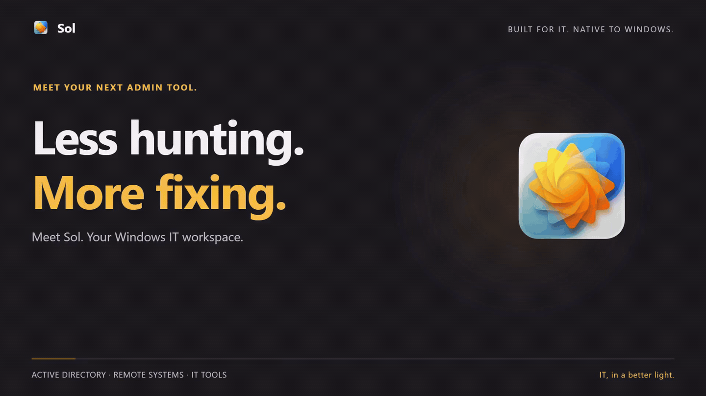

<div align="center">


# Sol ☀️

**A Modern Active Directory, Remote Systems Management & IT Tools Suite for Windows**

[](https://github.com/mm-dev-alpha/Sol/releases)
[](https://github.com/mm-dev-alpha/Sol/actions/workflows/ci.yml)
[](https://github.com/mm-dev-alpha/Sol/releases)
[](https://dotnet.microsoft.com/)
[](https://learn.microsoft.com/windows/apps/windows-app-sdk/)
[](LICENSE)
[](https://www.microsoft.com/windows)
[](https://www.buymeacoffee.com/mmdevalpha)

*Fast, elegant, and secure IT administration with native Fluent 2 design.*

</div>

---

## 🌟 Overview

**Sol** is a high-performance native Windows desktop application built for IT systems administrators, helpdesk engineers, and support teams. Built with **.NET 10** and **WinUI 3 (Windows App SDK 1.7)**, Sol unifies Active Directory directory services, remote endpoint diagnostics, BitLocker recovery key discovery, remote process and service control, side-by-side object comparison, and a dedicated tools page for system diagnostics, administration commands, and text manipulation into a fluid, distraction-free interface with native Mica backdrop material.

---

## 🎬 Showcase

<div align="center">
  
  <p><em>Instant Active Directory search, remote diagnostics, and BitLocker recovery key discovery.</em></p>
</div>

---

## ✨ Features

### 🔍 Central Landing Hub
- **Unified Fast Search**: Search for Active Directory **Users** and **Computers** with instant autocomplete and navigation.
- **Fluent 2 Design**: Native Mica backdrop with automatic Light and Dark theme adaptation.

### 👤 Active Directory User Workspace
- **Complete Profile & Identity**: Display Name, SamAccountName, UPN, Employee ID, OU Path, and Security Identifier (**SID**) with one-click copy buttons.
- **Organization & Reporting**: Manager navigation, direct reports hierarchy, and security group memberships.
- **Contact Information**: Phone numbers, office location, street address, and email.
- **Safe In-Place Editing**: Update user attributes directly in Active Directory with automatic audit logging.
- **Account & Security Controls**:
  - Reset passwords with auto-generated secure 16-character complex passwords (memory-safe char buffer zeroing).
  - Unlock locked accounts, enable/disable accounts, and set password expiry flags.
- **Raw Attribute Inspector**: Inspect all Active Directory attributes in a raw key-value view.

### 💻 Computer Workspace & Remote Diagnostics
- **Directory & Network Identity**: DNS Hostname, SAM Account Name, IPv4 Address, OU Path, Operating System version, and Owner (`ManagedBy`).
- **Hardware & BIOS Diagnostics**: Manufacturer, Model, Serial / Service Tag, BIOS version & release date, CPU, RAM, and one-click manufacturer warranty lookup link.
- **System Uptime & Reboot Status**: Precise uptime duration, last boot timestamp, and pending reboot detection (Component-Based Servicing, Windows Update, PendingFileRenameOperations).
- **Storage & Disk Health**: Logical drive partitions, capacity bars, free/total space, file system (NTFS/ReFS), and drive health status (SSD/NVMe).
- **Battery & Power Diagnostics**: Battery health percentage, wear level, full charge vs. design capacity, cycle count, estimated runtime, and charging status for mobile endpoints.
- **Active Logon Sessions**: Inspect active and disconnected console and RDP sessions with logon duration.
- **BitLocker Drive Encryption**: System drive encryption state (XTS-AES 128/256-Bit), protection status, and instant discovery of Active Directory BitLocker recovery passwords (`msFVE-RecoveryInformation`).
- **Quick Actions**: One-click Ping test, Remote Desktop (RDP), and remote PowerShell console launching.

### ⚖️ Active Directory Compare Workspace
- Side-by-side comparative inspection of Active Directory Users and Computers.
- Visual diff highlighting across group memberships, directory attributes, organizational units, and hardware specifications.

### ⚡ Remote Process Manager
- Standalone inspection window displaying live remote processes with PID, Name, User, CPU%, Memory (MB), and Network state.
- Instant search and multi-column sorting (PID, Name, User, CPU, Memory).
- Safe process termination with built-in protection guarding critical Windows OS processes (PID 0–4 and core system binaries).

### ⚙️ Remote Windows Services Inspector & Controller
- Inspect all installed Windows services with Display Name, Service Name, Status (Running / Stopped / Pending), Startup Type (Auto / Manual / Disabled), and Service Account (`StartName`).
- Filter by status (**All**, **Running**, **Stopped**) and live search.
- **Remote Service Control**: Start, stop, and restart services with confirmation dialogs.
- **Startup Type Configuration**: Change startup modes directly from a dropdown.
- **Built-in Safety**: 24 critical Windows OS services (RPC, LSASS, DHCP, EventLog, etc.) are protected against accidental stoppage.
- **Action Diagnostics**: Informative error translation for WMI return codes and local Administrator elevation guidance.

### 🧰 Tools Hub
Sol includes a dedicated **Tools** page offering essential system management utilities and desktop tools:

- **File Locksmith**: Inspect which processes are locking specific files or directories and terminate locking handles or processes cleanly with drag-and-drop support.
- **Shortcut Guide (`Win + Shift + ?`)**: Interactive on-screen overlay reference displaying keyboard shortcuts for Windows navigation, window snapping, and common operations.
- **MMC Administrative Consoles (`Alt + Space`)**: Searchable launcher for 40+ Microsoft Management Consoles (`.msc`) and control panel applets (`.cpl`) with category filtering and persistent favorites pinning.
- **Daily Admin Commands (`Win + Shift + C`)**: Curated catalog of 50+ essential administrative commands across PowerShell, Command Prompt, and Run dialogues with elevation awareness and favorites pinning.
- **Grab Frame (`Win + Shift + G`)**: Floating viewfinder window with native transparent backdrop, live OCR word detection, interactive draggable table column dividers, and auto-OCR debouncing.
- **Edit Text Window (`Win + Shift + E`)**: Dedicated text manipulation workbench featuring 40+ string transformation routines, structured table/spreadsheet formatting (TSV, CSV, Markdown, XML, transposition), and live math expression evaluation with running totals.

### 🎫 JIRA Integration
- Support for **Jira Data Center** (Personal Access Tokens) and **Jira Cloud** (Email + API Token).
- Secure token storage using **Windows Credential Locker (PasswordVault / DPAPI)** — zero plaintext secrets on disk.
- Query and view open tickets created by or associated with the active user directly in the workspace.

### 📋 Comprehensive "Copy All" Export
- One-click copy on both User and Computer workspaces exports 100% of all loaded Active Directory properties, metadata, and diagnostic modules into cleanly structured, key-value formatted text ready for tickets, audits, or documentation.

---

## 🛠️ Architecture & Tech Stack

| Component | Technology |
|---|---|
| **Runtime & Language** | [.NET 10 (C# 14)](https://dotnet.microsoft.com/) |
| **UI Framework** | [WinUI 3 / Windows App SDK 1.7](https://learn.microsoft.com/windows/apps/winui/winui3/) |
| **Architecture** | MVVM via [CommunityToolkit.Mvvm](https://learn.microsoft.com/dotnet/communitytoolkit/mvvm/) |
| **Controls & Styling** | [CommunityToolkit.WinUI](https://learn.microsoft.com/windows/communitytoolkit/) (SettingsCard, Segmented, Mica) |
| **Directory Services** | LDAP via `System.DirectoryServices.AccountManagement` & `System.DirectoryServices` |
| **Remote Diagnostics** | WMI / CIM (`System.Management`) with CLI and native WTS fallback |
| **Credential Security** | Windows Credential Locker (`Windows.Security.Credentials.PasswordVault`) |
| **OCR & Vision** | Windows AI OCR & Windows.Media.Ocr (WinRT) |
| **Deployment Model** | Self-contained, single-file unpackaged binary (no MSIX or Store required) |

---

## 🚀 Getting Started

### System Requirements
- **Windows 11** (recommended) or **Windows 10** (Version 1809+, Build 17763+)
- **Windows Server 2025 / 2022 / 2019**
- Domain-joined machine or RSAT installed for Active Directory operations

### Installation

Download the latest standalone release from the [**Releases**](https://github.com/mm-dev-alpha/Sol/releases) page:

1. Download `Sol-v4.0.0-win-x64.zip`.
2. Extract the archive to any folder.
3. Run `Sol.exe`.

---

### Building from Source

```bash
# Clone the repository
git clone https://github.com/mm-dev-alpha/Sol.git
cd Sol

# Restore dependencies
dotnet restore src/Sol/Sol.csproj
dotnet restore src/Sol.Tests/Sol.Tests.csproj

# Run all unit tests
dotnet test src/Sol.Tests/Sol.Tests.csproj -c Release

# Run Sol in Debug mode
dotnet run --project src/Sol/Sol.csproj
```

### Creating a Self-Contained Release Build

```powershell
dotnet publish src/Sol/Sol.csproj -c Release -r win-x64 --self-contained -o ./publish
```

---

## 🔒 Security & Privacy

- **Zero Telemetry**: Sol collects, stores, and transmits zero telemetry, usage statistics, or analytics.
- **Audit-Proof Credential Storage**: All JIRA API tokens and PATs are encrypted via Windows Credential Locker (DPAPI).
- **RFC 4515 LDAP Escaping**: All directory search queries are sanitized to prevent LDAP filter injection.
- **Structured Shell Execution**: External command invocations (`sc.exe`, `taskkill.exe`, `logoff.exe`, PowerShell) use `ProcessStartInfo.ArgumentList` to eliminate command-line argument injection risks.
- **Safe Clipboard**: Passwords and BitLocker recovery keys use `SetContentWithOptions` flags to exclude sensitive strings from cloud clipboard history.
- **Memory Hygiene**: Active Directory password resets use char buffer zeroing to prevent plaintext credentials from remaining in memory.
- **Destructive Action Confirmation**: Password resets, account disables, process terminations, and service stoppages require explicit confirmation.
- **Local Audit Logging**: Attribute modifications and application crashes are logged locally to `%LocalAppData%\Sol\Logs\` with automatic log rolling.

---

## ☕ Support the Project

If Sol simplifies your daily IT workflow, consider supporting its development:

[](https://www.buymeacoffee.com/mmdevalpha)

---

## 📄 License

This project is licensed under the **MIT License** — see the [LICENSE](LICENSE) file for details.

---

<div align="center">
  <sub>Built with ❤️ by <a href="https://github.com/mm-dev-alpha">@mm-dev-alpha</a> for IT Professionals</sub>
</div>
